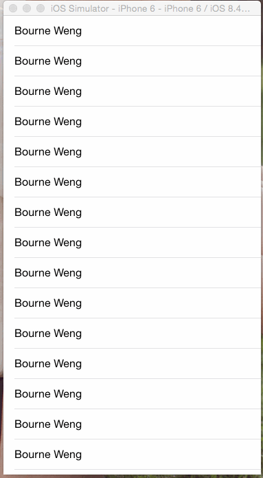

####This is a custom `Activity Indicator View`, the point is what it's look:    



####Yes! It's a pac-man. And you can add to you project easily!

##How tu use?

####Drag the file `PacManIndicatorView.swift` to project, and then:

```swift 
let indicator = PacmanIndicatorView(frame: CGRectMake(100, 100, 200, 50))
indicator.startAnimating()
self.view.addSubview(indicator)
```

###if you want to stop it, then:

```swift
indicator.stopAnimating()
```

###you can also change the color at anywhere like this:

```swift
indicator.pacmanColor = UIColor.redColor()
indicator.beansColor = UIColor.greenColor()
```

###if you want to control the open progress of mouth, just like this:

```swift
override func scrollViewDidScroll(scrollView: UIScrollView) {
    let offset = max(min(0, scrollView.contentOffset.y), -100)

    indicator.openMouthProgress = abs(offset) / 100
    indicator.hidden = false
}
```